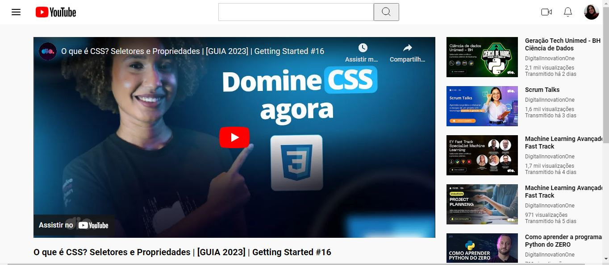

## 👨‍💻 Desafio de Projeto CSS: Clonando a Página do Youtube com CSS
Projeto de HMTL e CSS de Clone da página do Youtube utilizando Flexbox.  
Esse projeto foi proposto por  Michele Ambrosio da plataforma educacional DIO na Formação CSS Developer.

## 🖥 Preview:

- Venha ver como ficou o projeto acessando [aqui nesse link do GithubPages](https://deboramc05.github.io/desafio-clone-youtube/)

## 🤔 O que foi feito nesse projeto:
- Crei um clone da página do Youtube utilizando os conceitos de Flexbox;
- Neste projeto segui as orientações do arquivo do Figma disponibilizado no curso.

## 📌 Créditos
- **Assets:** Disponível no protótipo do Figma disponibilizado no curso.
- **Vídeo do Youtube utilizado no projeto:** [Vídeo do canal da DIO: O que é CSS? Seletores e Propriedades | [GUIA 2023]](https://www.youtube.com/watch?v=HuEADvyhork&t=12s)

 